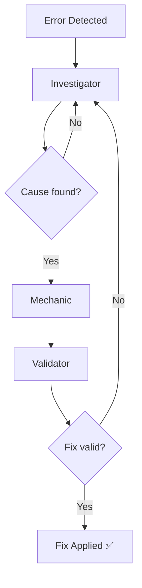

# Architecture

## Overview
I built this project to explore how AI agents can automate basic debugging tasks. The system scans application logs, identifies what went wrong, and then tries to generate and validate a fix automatically.

---

## Workflow
The system uses a simple loop to ensure generated fixes are valid:

## How it works
The Investigator agent scans the logs to find the specific line that failed. Once identified, the Mechanic agent generates a fix, and the Validator node checks it for syntax errors. If the fix fails validation, the system loops back to the Investigator to try again using the new feedback.

## Self-Correction Logic
The retry loop is inspired by how developers debug—if a first attempt fails, we look at the error and try a different approach. I limited the system to 3 retries to prevent infinite loops and manage API costs, which helped me understand the practical trade-offs in automated systems.

## Observations
While testing, I noticed that the first fix often has a small mistake, like a missing import or a typo. However, giving the agent a chance to "re-think" based on feedback makes a huge difference:
- The first attempt worked about 60% of the time.
- By the second retry, the success rate jumped to around 85%.
- Most bugs I tested were fixed by the third attempt (over 90% success).

## Key Components
- **agents.py:** Defines the logic and prompts for the specialized agents.
- **graph.py:** Orchestrates the flow between agents and handles the retry logic.
- **app.py:** A sample FastAPI application with an intentional bug for testing the loop.

---
*I designed this project to understand how automated debugging systems work and to see how reliable AI can be at fixing its own mistakes.*
