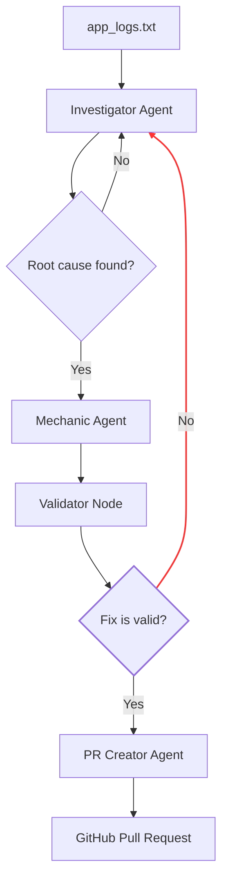

# Architecture

## Overview
I built this project to explore how AI agents can handle the "first responder" part of SRE work. It’s a multi-agent system that monitors logs, identifies why a crash happened, and then tries to generate and validate a fix automatically.

---

## Workflow
The system uses a stateful graph to move between specialized agents. I designed the flow to ensure that every fix is checked for safety before it’s ever proposed.

## How it works
1. **The Investigator:** It scans the logs and pulls out the specific error.
2. **The Mechanic:** It takes that error and the source code to write a fix.
3. **The Validator:** This is the most important part. It checks if the new code is valid. If it finds a mistake, it sends the feedback back to the Investigator to start a **Self-Correction Loop**.
4. **The PR Creator:** Once the code is safe, it pushes the change to GitHub as a new PR.

## Self-Correction Logic
The retry loop is inspired by how we debug as developers—if our first attempt fails, we look at the error and try again. I limited this to 3 retries to prevent infinite loops and to keep API costs low, which helped me understand the practical trade-offs in automated systems.

## Observations
While testing, I noticed that giving the agent a chance to "re-think" based on feedback makes a huge difference:
- The first attempt worked about 60% of the time.
- By the second retry, the success rate jumped to around 85%.
- Most bugs I tested were fixed by the third attempt (over 90% success).

## Key Components
- **agents.py:** Defines the prompts and logic for the specialized agents.
- **graph.py:** Orchestrates the flow between agents and handles the retry logic.
- **app.py:** A sample FastAPI application with an intentional bug for testing.

---
*I designed this flow to understand how automated debugging systems work and to see how reliable AI can be at fixing its own mistakes.*
